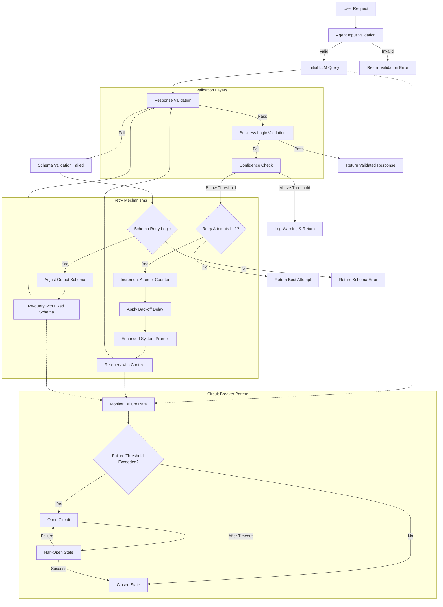

# PydanticAI Best Practices

This document outlines architectural best practices and workflow patterns for building production-grade AI applications with PydanticAI.

## Overview

PydanticAI is a Python agent framework designed to bring the FastAPI development experience to GenAI applications. It emphasizes type safety, structured responses, and Python-centric design patterns.

## Core Architectural Principles

### Type-Safe Design

- Leverage Pydantic's validation system for structured, consistent model outputs
- Full type checking support throughout the application
- Structured responses ensure consistency across runs

### Agent-Centric Architecture

- Agents serve as reusable containers for system prompts, tools, and output validators
- Design agents similar to FastAPI apps or APIRouters
- Instantiate agents once (typically as module globals) and reuse throughout the application
- Each agent uses pydantic-graph internally to manage execution flow

### Dependency Injection System

- Optional dependency injection system for providing data and services
- Supports agents, system prompts, tools, and result validators
- Particularly useful for testing and evaluation-driven iterative development
- Enables clean separation of concerns and easier testing

## Workflow Design Patterns

### AI Workflows vs Autonomous Agents

**AI Workflows**: Systems where LLMs and tools are orchestrated through predefined code paths. More predictable and easier to understand.

**Autonomous Agents**: Systems where LLMs dynamically direct their own processes with less predictable outcomes.

### Core Workflow Patterns

#### Prompt Chaining

Decompose complex tasks into smaller parts where each LLM output feeds into the next step.

```python
# Example: Multi-step analysis
agent1_result = analysis_agent.run("Analyze market data")
agent2_result = summary_agent.run(f"Summarize: {agent1_result}")
```

#### Routing Pattern

Classify inputs and direct them to specialized follow-up tasks.

```python
@router_agent.tool
def classify_request(request: str) -> RequestType:
    # Classification logic
    pass
```

#### Parallelization

Split tasks and send parts to multiple LLMs simultaneously using asyncio.

```python
async def parallel_analysis():
    tasks = [
        agent1.run_async(data_chunk1),
        agent2.run_async(data_chunk2),
        agent3.run_async(data_chunk3)
    ]
    results = await asyncio.gather(*tasks)
    return combine_results(results)
```

#### Orchestrator-Workers

Combine routing and parallelization to handle complex multi-source queries.

#### Evaluator-Optimizer

Iterative improvement of LLM outputs through feedback loops.

```python
@evaluator_agent.tool
def evaluate_output(output: str) -> EvaluationResult:
    # Evaluation logic
    pass

# Iterative improvement loop
while not meets_criteria(result):
    result = optimizer_agent.run(f"Improve: {result}")
```

## Advanced Architectural Features

### Graph-Based Workflows

- Use pydantic-graph for complex state machine workflows
- Define nodes as states, letting LLMs decide the next step
- Powerful for multi-step automation with structured validation
- Useful when standard control flow becomes unwieldy

### Multi-Agent Systems

- Multiple agents can interact through message history and dynamic runtime context
- Each agent can operate with its own model
- Enables complex workflows through agent collaboration
- Supports specialized agents for different tasks

### Model Agnostic Support

Supports multiple model providers:

- OpenAI
- Anthropic
- Gemini
- Deepseek
- Ollama
- Groq
- Cohere
- Mistral

Simple interface for implementing additional model support.

## Implementation Best Practices

### Agent Creation and Structure

```python
from pydantic_ai import Agent
from pydantic import BaseModel

class ResponseModel(BaseModel):
    result: str
    confidence: float

# Create agent with structured output
agent = Agent(
    model='openai:gpt-4',
    result_type=ResponseModel,
    system_prompt="You are a helpful assistant."
)
```

### Tool Integration

```python
@agent.tool
def fetch_data(query: str) -> str:
    # Tool implementation
    return "data"

# Use tools in agent execution
result = agent.run("Process this request")
```

### Dependency Management

```python
from pydantic_ai import RunContext

@agent.system_prompt
def dynamic_prompt(ctx: RunContext[Dependencies]) -> str:
    return f"Use this context: {ctx.deps.context_data}"
```

## Dependency Injection System

PydanticAI's dependency injection system provides a clean way to manage external services, configuration, and shared state across agents, tools, and system prompts.

### Basic Dependency Structure

```python
from dataclasses import dataclass
from typing import Protocol
import structlog

@dataclass
class AppDependencies:
    """Main application dependencies"""
    database: DatabaseClient
    cache: CacheService
    config: AppConfig
    logger: structlog.BoundLogger
    metrics: MetricsCollector

class DatabaseClient(Protocol):
    async def get_user(self, user_id: str) -> dict: ...
    async def save_analysis(self, analysis: dict) -> str: ...

class CacheService(Protocol):
    async def get(self, key: str) -> Optional[str]: ...
    async def set(self, key: str, value: str, ttl: int = 3600) -> None: ...
```

### Agent with Dependency Injection

```python
from pydantic_ai import Agent, RunContext

analysis_agent = Agent(
    model='openai:gpt-4',
    result_type=AnalysisResult,
    deps_type=AppDependencies
)

@analysis_agent.system_prompt
def get_system_prompt(ctx: RunContext[AppDependencies]) -> str:
    """Dynamic system prompt based on configuration"""
    config = ctx.deps.config
    return f"""You are a {config.analysis_type} analyst for {config.company_name}.
    
    Analysis Guidelines:
    - Use {config.confidence_threshold} as minimum confidence threshold
    - Include {config.required_sections} in all reports
    - Follow {config.regulatory_framework} compliance requirements
    
    Current session: {ctx.deps.logger.bind(session_id=ctx.session_id)}
    """

@analysis_agent.tool
async def fetch_historical_data(
    ctx: RunContext[AppDependencies], 
    symbol: str, 
    timeframe: str
) -> dict:
    """Fetch data with caching and logging"""
    cache_key = f"hist_data:{symbol}:{timeframe}"
    
    # Try cache first
    cached_data = await ctx.deps.cache.get(cache_key)
    if cached_data:
        ctx.deps.logger.info("Cache hit", symbol=symbol, timeframe=timeframe)
        return json.loads(cached_data)
    
    # Fetch from database
    ctx.deps.logger.info("Fetching from database", symbol=symbol)
    data = await ctx.deps.database.get_historical_data(symbol, timeframe)
    
    # Cache result
    await ctx.deps.cache.set(cache_key, json.dumps(data), ttl=1800)
    
    # Record metrics
    ctx.deps.metrics.increment("data_fetch.database_calls")
    
    return data

@analysis_agent.tool
async def save_analysis_result(
    ctx: RunContext[AppDependencies],
    result: AnalysisResult
) -> str:
    """Save analysis with audit logging"""
    try:
        analysis_id = await ctx.deps.database.save_analysis({
            'result': result.dict(),
            'timestamp': datetime.utcnow(),
            'session_id': ctx.session_id,
            'model_used': ctx.model.name
        })
        
        ctx.deps.logger.info(
            "Analysis saved",
            analysis_id=analysis_id,
            confidence=result.confidence_score
        )
        
        ctx.deps.metrics.increment("analysis.saved")
        return analysis_id
        
    except Exception as e:
        ctx.deps.logger.error("Failed to save analysis", error=str(e))
        ctx.deps.metrics.increment("analysis.save_errors")
        raise
```

### Environment-Specific Dependencies

```python
from abc import ABC, abstractmethod
from typing import Union

class Environment(str, Enum):
    DEVELOPMENT = "development"
    STAGING = "staging"
    PRODUCTION = "production"

class ConfigBase(ABC):
    @abstractmethod
    def get_database_url(self) -> str: ...
    
    @abstractmethod
    def get_cache_settings(self) -> dict: ...

@dataclass
class DevelopmentConfig(ConfigBase):
    def get_database_url(self) -> str:
        return "sqlite:///dev.db"
    
    def get_cache_settings(self) -> dict:
        return {"backend": "memory", "ttl": 300}

@dataclass
class ProductionConfig(ConfigBase):
    def get_database_url(self) -> str:
        return os.getenv("DATABASE_URL")
    
    def get_cache_settings(self) -> dict:
        return {
            "backend": "redis",
            "host": os.getenv("REDIS_HOST"),
            "ttl": 3600
        }

class DependencyFactory:
    @staticmethod
    async def create_dependencies(env: Environment) -> AppDependencies:
        """Factory for creating environment-specific dependencies"""
        
        if env == Environment.DEVELOPMENT:
            config = DevelopmentConfig()
            database = SqliteClient(config.get_database_url())
            cache = MemoryCache()
        else:
            config = ProductionConfig()
            database = PostgresClient(config.get_database_url())
            cache = RedisCache(config.get_cache_settings())
        
        logger = structlog.get_logger().bind(environment=env.value)
        metrics = MetricsCollector(environment=env.value)
        
        return AppDependencies(
            database=database,
            cache=cache,
            config=config,
            logger=logger,
            metrics=metrics
        )

# Usage
async def main():
    env = Environment(os.getenv("APP_ENV", "development"))
    deps = await DependencyFactory.create_dependencies(env)
    
    result = await analysis_agent.run_async(
        "Analyze AAPL stock performance",
        deps=deps
    )
```

### Multi-Tenant Dependencies

```python
@dataclass
class TenantDependencies:
    """Tenant-specific dependencies with isolation"""
    tenant_id: str
    database: TenantDatabase
    file_storage: TenantStorage
    settings: TenantSettings
    logger: structlog.BoundLogger

class TenantDatabase:
    def __init__(self, tenant_id: str, connection_pool):
        self.tenant_id = tenant_id
        self.pool = connection_pool
    
    async def get_data(self, query: str) -> dict:
        # Automatically scope queries to tenant
        scoped_query = f"{query} WHERE tenant_id = '{self.tenant_id}'"
        return await self.pool.execute(scoped_query)

multi_tenant_agent = Agent(
    model='anthropic:claude-3-sonnet',
    result_type=ReportResult,
    deps_type=TenantDependencies
)

@multi_tenant_agent.system_prompt
def tenant_prompt(ctx: RunContext[TenantDependencies]) -> str:
    """Tenant-aware system prompt"""
    settings = ctx.deps.settings
    return f"""You are generating a report for {settings.company_name}.
    
    Tenant Configuration:
    - Industry: {settings.industry}
    - Compliance: {settings.compliance_requirements}
    - Branding: {settings.brand_guidelines}
    - Data Retention: {settings.data_retention_days} days
    
    All data access is automatically scoped to tenant: {ctx.deps.tenant_id}
    """

@multi_tenant_agent.tool
async def get_tenant_data(
    ctx: RunContext[TenantDependencies],
    data_type: str
) -> dict:
    """Fetch tenant-scoped data"""
    ctx.deps.logger.info(
        "Fetching tenant data",
        tenant_id=ctx.deps.tenant_id,
        data_type=data_type
    )
    
    # Database automatically scopes to tenant
    return await ctx.deps.database.get_data(
        f"SELECT * FROM {data_type}_data"
    )

# Tenant-specific usage
async def process_tenant_request(tenant_id: str, request: str):
    tenant_deps = await create_tenant_dependencies(tenant_id)
    
    result = await multi_tenant_agent.run_async(request, deps=tenant_deps)
    return result
```

### Testing with Dependency Injection

```python
import pytest
from unittest.mock import AsyncMock, Mock

@pytest.fixture
async def test_dependencies():
    """Create test dependencies with mocks"""
    return AppDependencies(
        database=AsyncMock(spec=DatabaseClient),
        cache=AsyncMock(spec=CacheService),
        config=Mock(
            analysis_type="financial",
            company_name="Test Corp",
            confidence_threshold=0.8
        ),
        logger=Mock(),
        metrics=Mock()
    )

@pytest.mark.asyncio
async def test_analysis_with_cache_hit(test_dependencies):
    """Test analysis behavior with cached data"""
    # Setup mock responses
    test_dependencies.cache.get.return_value = '{"price": 150.0, "volume": 1000}'
    
    result = await analysis_agent.run_async(
        "Analyze AAPL performance",
        deps=test_dependencies
    )
    
    # Verify cache was checked
    test_dependencies.cache.get.assert_called_once()
    # Verify database was not called
    test_dependencies.database.get_historical_data.assert_not_called()
    # Verify metrics were recorded
    test_dependencies.metrics.increment.assert_called()

@pytest.mark.asyncio
async def test_dependency_failure_handling():
    """Test graceful handling of dependency failures"""
    failing_deps = AppDependencies(
        database=AsyncMock(side_effect=ConnectionError("DB unavailable")),
        cache=AsyncMock(),
        config=Mock(),
        logger=Mock(),
        metrics=Mock()
    )
    
    with pytest.raises(ConnectionError):
        await analysis_agent.run_async(
            "Analyze data",
            deps=failing_deps
        )
    
    # Verify error was logged
    failing_deps.logger.error.assert_called()
```

### Dependency Composition Patterns

```python
from typing import TypeVar, Generic

T = TypeVar('T')

class DependencyContainer(Generic[T]):
    """Generic dependency container with lifecycle management"""
    
    def __init__(self):
        self._instances: Dict[str, Any] = {}
        self._factories: Dict[str, Callable] = {}
    
    def register_factory(self, name: str, factory: Callable[[], T]) -> None:
        """Register a factory for lazy initialization"""
        self._factories[name] = factory
    
    def register_instance(self, name: str, instance: T) -> None:
        """Register a pre-created instance"""
        self._instances[name] = instance
    
    def get(self, name: str) -> T:
        """Get dependency with lazy initialization"""
        if name in self._instances:
            return self._instances[name]
        
        if name in self._factories:
            instance = self._factories[name]()
            self._instances[name] = instance
            return instance
        
        raise ValueError(f"Dependency '{name}' not registered")
    
    async def cleanup(self):
        """Cleanup resources"""
        for instance in self._instances.values():
            if hasattr(instance, 'close'):
                await instance.close()

# Usage with composition
class ComposedDependencies:
    def __init__(self, container: DependencyContainer):
        self.container = container
    
    @property
    def database(self) -> DatabaseClient:
        return self.container.get('database')
    
    @property
    def cache(self) -> CacheService:
        return self.container.get('cache')
    
    @property
    def logger(self) -> structlog.BoundLogger:
        return self.container.get('logger')

# Setup
async def setup_application():
    container = DependencyContainer()
    
    # Register factories for lazy initialization
    container.register_factory('database', lambda: PostgresClient(DATABASE_URL))
    container.register_factory('cache', lambda: RedisCache(CACHE_CONFIG))
    container.register_factory('logger', lambda: structlog.get_logger())
    
    return ComposedDependencies(container)

# Agent usage
composed_agent = Agent(
    model='openai:gpt-4',
    result_type=AnalysisResult,
    deps_type=ComposedDependencies
)

@composed_agent.system_prompt
def composed_prompt(ctx: RunContext[ComposedDependencies]) -> str:
    """Access dependencies through composition"""
    ctx.deps.logger.info("Generating system prompt")
    return "You are a helpful analyst with access to real-time data."
```

### Streaming Responses

- Support for real-time streaming of LLM responses
- Immediate validation of streamed content
- Useful for long-running or interactive applications

## Scalability Considerations

### Enterprise-Level Applications

- Flexible architecture ensures maintainability as projects grow
- Easy adaptation to changing requirements and new technologies
- Critical for handling enterprise-level AI workloads

### Testing and Evaluation

- Dependency injection facilitates comprehensive testing
- Eval-driven iterative development supported
- Type safety enables better IDE support and error catching

## Configuration Patterns

### Environment-Based Setup

```bash
export OPENAI_API_KEY=your-api-key
export ANTHROPIC_API_KEY=your-api-key
```

### Module Organization

```python
# agents.py - Define reusable agents
weather_agent = Agent(model='openai:gpt-4', ...)
support_agent = Agent(model='anthropic:claude-3', ...)

# main.py - Use agents
from agents import weather_agent
result = weather_agent.run("What's the weather?")
```

## Performance Optimization

### Async Operations

- Use `run_async()` for non-blocking operations
- Leverage asyncio for parallel processing
- Combine with streaming for responsive applications

### Resource Management

- Reuse agent instances across requests
- Consider model-specific rate limits and costs
- Implement proper error handling and retries

## Security Considerations

- Validate all inputs using Pydantic models
- Implement proper authentication for model API keys
- Consider data privacy when using external model providers
- Use dependency injection to manage sensitive configuration

## Monitoring and Observability

- Log structured outputs for debugging
- Monitor model usage and costs
- Track agent performance metrics
- Implement proper error handling and alerting

## Validation and Re-Query Architecture

The following diagram illustrates how PydanticAI agents can implement automatic validation and re-querying workflows:



## Example Agent Implementations

### Data Analysis Agent with Validation

```python
from pydantic_ai import Agent, RunContext
from pydantic import BaseModel, Field, validator
from typing import List, Optional
import asyncio
import logging
from datetime import datetime

class AnalysisRequest(BaseModel):
    dataset: str = Field(..., min_length=1, description="Dataset identifier")
    metrics: List[str] = Field(..., min_items=1, description="Metrics to analyze")
    time_range: Optional[str] = Field(None, description="Time range filter")

class AnalysisResult(BaseModel):
    summary: str = Field(..., min_length=10, description="Analysis summary")
    key_insights: List[str] = Field(..., min_items=1, max_items=5)
    confidence_score: float = Field(..., ge=0.0, le=1.0)
    timestamp: datetime = Field(default_factory=datetime.now)
    
    @validator('key_insights')
    def validate_insights(cls, v):
        if any(len(insight.strip()) < 5 for insight in v):
            raise ValueError("Each insight must be at least 5 characters")
        return v

class Dependencies:
    def __init__(self, db_client, logger):
        self.db_client = db_client
        self.logger = logger

analysis_agent = Agent(
    model='openai:gpt-4',
    result_type=AnalysisResult,
    system_prompt="You are a data analysis expert. Provide thorough, accurate analysis with actionable insights."
)

@analysis_agent.tool
async def fetch_dataset(ctx: RunContext[Dependencies], dataset_id: str) -> dict:
    """Fetch dataset with error handling and validation"""
    try:
        ctx.deps.logger.info(f"Fetching dataset: {dataset_id}")
        data = await ctx.deps.db_client.get_dataset(dataset_id)
        if not data:
            raise ValueError(f"Dataset {dataset_id} not found")
        return data
    except Exception as e:
        ctx.deps.logger.error(f"Failed to fetch dataset {dataset_id}: {e}")
        raise

@analysis_agent.tool
async def calculate_metrics(ctx: RunContext[Dependencies], data: dict, metrics: List[str]) -> dict:
    """Calculate requested metrics with validation"""
    try:
        results = {}
        for metric in metrics:
            if metric not in data.get('available_metrics', []):
                raise ValueError(f"Metric {metric} not available in dataset")
            results[metric] = await ctx.deps.db_client.calculate_metric(data['id'], metric)
        return results
    except Exception as e:
        ctx.deps.logger.error(f"Failed to calculate metrics: {e}")
        raise

async def analyze_with_retry(request: AnalysisRequest, deps: Dependencies, max_retries: int = 3) -> AnalysisResult:
    """Execute analysis with retry logic and validation"""
    for attempt in range(max_retries):
        try:
            deps.logger.info(f"Analysis attempt {attempt + 1} for dataset {request.dataset}")
            
            result = await analysis_agent.run_async(
                f"Analyze dataset {request.dataset} for metrics: {', '.join(request.metrics)}",
                deps=deps
            )
            
            # Additional business logic validation
            if result.confidence_score < 0.7:
                deps.logger.warning(f"Low confidence score: {result.confidence_score}")
                if attempt < max_retries - 1:
                    continue
            
            deps.logger.info(f"Analysis completed successfully on attempt {attempt + 1}")
            return result
            
        except Exception as e:
            deps.logger.error(f"Analysis attempt {attempt + 1} failed: {e}")
            if attempt == max_retries - 1:
                raise
            await asyncio.sleep(2 ** attempt)  # Exponential backoff
```

### Customer Support Agent with Escalation

```python
from enum import Enum
from typing import Union
import structlog

class SupportCategory(str, Enum):
    TECHNICAL = "technical"
    BILLING = "billing"
    GENERAL = "general"
    ESCALATION = "escalation"

class SupportRequest(BaseModel):
    message: str = Field(..., min_length=10, max_length=1000)
    customer_id: str = Field(..., regex=r'^[A-Z0-9]{8}$')
    priority: str = Field(default="normal", regex=r'^(low|normal|high|urgent)$')

class SupportResponse(BaseModel):
    response: str = Field(..., min_length=20)
    category: SupportCategory
    escalate: bool = Field(default=False)
    confidence: float = Field(..., ge=0.0, le=1.0)
    next_actions: List[str] = Field(default_factory=list)

class SupportDependencies:
    def __init__(self, customer_db, ticket_system, escalation_service):
        self.customer_db = customer_db
        self.ticket_system = ticket_system
        self.escalation_service = escalation_service
        self.logger = structlog.get_logger()

support_agent = Agent(
    model='anthropic:claude-3-sonnet',
    result_type=SupportResponse,
    system_prompt="""You are a customer support specialist. 
    Provide helpful, professional responses. 
    Escalate complex technical issues or billing disputes."""
)

@support_agent.tool
async def get_customer_info(ctx: RunContext[SupportDependencies], customer_id: str) -> dict:
    """Retrieve customer information with error handling"""
    try:
        customer = await ctx.deps.customer_db.get_customer(customer_id)
        if not customer:
            raise ValueError(f"Customer {customer_id} not found")
        
        # Return sanitized customer info
        return {
            'tier': customer.get('tier', 'standard'),
            'account_status': customer.get('status', 'active'),
            'recent_issues': customer.get('recent_tickets', [])[-5:]  # Last 5 tickets
        }
    except Exception as e:
        ctx.deps.logger.error("Failed to fetch customer info", customer_id=customer_id, error=str(e))
        return {'tier': 'standard', 'account_status': 'unknown', 'recent_issues': []}

@support_agent.tool
async def create_ticket(ctx: RunContext[SupportDependencies], customer_id: str, category: str, summary: str) -> str:
    """Create support ticket with validation"""
    try:
        ticket_id = await ctx.deps.ticket_system.create_ticket({
            'customer_id': customer_id,
            'category': category,
            'summary': summary,
            'status': 'open'
        })
        ctx.deps.logger.info("Ticket created", ticket_id=ticket_id, customer_id=customer_id)
        return ticket_id
    except Exception as e:
        ctx.deps.logger.error("Failed to create ticket", error=str(e))
        raise

async def handle_support_request(request: SupportRequest, deps: SupportDependencies) -> SupportResponse:
    """Handle support request with validation and escalation logic"""
    try:
        # Validate request
        if not request.message.strip():
            raise ValueError("Message cannot be empty")
        
        deps.logger.info("Processing support request", 
                        customer_id=request.customer_id, 
                        priority=request.priority)
        
        response = await support_agent.run_async(
            f"Customer {request.customer_id} ({request.priority} priority): {request.message}",
            deps=deps
        )
        
        # Auto-escalation logic
        if response.escalate or response.confidence < 0.6 or request.priority == "urgent":
            await deps.escalation_service.escalate(request.customer_id, response.response)
            deps.logger.info("Request escalated", customer_id=request.customer_id)
        
        return response
        
    except Exception as e:
        deps.logger.error("Support request failed", error=str(e), customer_id=request.customer_id)
        # Return fallback response
        return SupportResponse(
            response="I apologize, but I'm experiencing technical difficulties. Your request has been forwarded to our technical team.",
            category=SupportCategory.ESCALATION,
            escalate=True,
            confidence=0.0,
            next_actions=["manual_review", "escalate_to_human"]
        )
```

### Financial Analysis Agent with Circuit Breaker

```python
from dataclasses import dataclass
from datetime import datetime, timedelta
import time

@dataclass
class CircuitBreakerState:
    failure_count: int = 0
    last_failure_time: Optional[datetime] = None
    state: str = "closed"  # closed, open, half_open

class FinancialData(BaseModel):
    symbol: str = Field(..., regex=r'^[A-Z]{1,5}$')
    price: float = Field(..., gt=0)
    volume: int = Field(..., ge=0)
    market_cap: Optional[float] = Field(None, gt=0)

class FinancialAnalysis(BaseModel):
    recommendation: str = Field(..., regex=r'^(buy|sell|hold)$')
    target_price: float = Field(..., gt=0)
    risk_level: str = Field(..., regex=r'^(low|medium|high)$')
    reasoning: str = Field(..., min_length=50)
    data_sources: List[str] = Field(..., min_items=1)

class FinancialDependencies:
    def __init__(self, market_data_api, risk_service):
        self.market_data_api = market_data_api
        self.risk_service = risk_service
        self.logger = structlog.get_logger()
        self.circuit_breaker = CircuitBreakerState()

financial_agent = Agent(
    model='openai:gpt-4',
    result_type=FinancialAnalysis,
    system_prompt="You are a financial analyst. Provide conservative, well-reasoned investment analysis."
)

def circuit_breaker_check(deps: FinancialDependencies) -> bool:
    """Check circuit breaker state"""
    if deps.circuit_breaker.state == "open":
        if deps.circuit_breaker.last_failure_time:
            time_since_failure = datetime.now() - deps.circuit_breaker.last_failure_time
            if time_since_failure > timedelta(minutes=5):  # 5-minute timeout
                deps.circuit_breaker.state = "half_open"
                deps.logger.info("Circuit breaker transitioning to half-open")
                return True
        return False
    return True

def record_success(deps: FinancialDependencies):
    """Record successful operation"""
    deps.circuit_breaker.failure_count = 0
    deps.circuit_breaker.state = "closed"

def record_failure(deps: FinancialDependencies):
    """Record failed operation"""
    deps.circuit_breaker.failure_count += 1
    deps.circuit_breaker.last_failure_time = datetime.now()
    
    if deps.circuit_breaker.failure_count >= 3:
        deps.circuit_breaker.state = "open"
        deps.logger.error("Circuit breaker opened due to repeated failures")

@financial_agent.tool
async def get_market_data(ctx: RunContext[FinancialDependencies], symbol: str) -> FinancialData:
    """Fetch market data with circuit breaker protection"""
    if not circuit_breaker_check(ctx.deps):
        raise Exception("Circuit breaker open - market data service unavailable")
    
    try:
        data = await ctx.deps.market_data_api.get_quote(symbol)
        record_success(ctx.deps)
        return FinancialData(**data)
    except Exception as e:
        record_failure(ctx.deps)
        ctx.deps.logger.error("Market data fetch failed", symbol=symbol, error=str(e))
        raise

@financial_agent.tool
async def assess_risk(ctx: RunContext[FinancialDependencies], symbol: str, data: FinancialData) -> dict:
    """Assess investment risk"""
    try:
        risk_metrics = await ctx.deps.risk_service.calculate_risk(symbol, data.dict())
        return risk_metrics
    except Exception as e:
        ctx.deps.logger.error("Risk assessment failed", symbol=symbol, error=str(e))
        return {"risk_level": "high", "confidence": 0.0}

async def analyze_investment(symbol: str, deps: FinancialDependencies, max_retries: int = 2) -> FinancialAnalysis:
    """Analyze investment with retries and circuit breaker"""
    for attempt in range(max_retries):
        try:
            if not circuit_breaker_check(deps):
                raise Exception("Circuit breaker open - analysis unavailable")
            
            deps.logger.info("Starting financial analysis", symbol=symbol, attempt=attempt + 1)
            
            result = await financial_agent.run_async(
                f"Analyze investment opportunity for {symbol}",
                deps=deps
            )
            
            # Validate result consistency
            if result.recommendation == "buy" and result.risk_level == "high":
                deps.logger.warning("Inconsistent recommendation detected", symbol=symbol)
                if attempt < max_retries - 1:
                    continue
            
            record_success(deps)
            return result
            
        except Exception as e:
            record_failure(deps)
            deps.logger.error("Analysis failed", symbol=symbol, attempt=attempt + 1, error=str(e))
            if attempt == max_retries - 1:
                raise
            await asyncio.sleep(1 * (attempt + 1))  # Linear backoff
```

### Testing Example Agents

```python
import pytest
from unittest.mock import AsyncMock, Mock

@pytest.fixture
def mock_dependencies():
    return Dependencies(
        db_client=AsyncMock(),
        logger=Mock()
    )

@pytest.mark.asyncio
async def test_analysis_agent_validation(mock_dependencies):
    """Test analysis agent with invalid input"""
    request = AnalysisRequest(
        dataset="test_dataset",
        metrics=["revenue", "growth"]
    )
    
    # Mock dataset fetch failure
    mock_dependencies.db_client.get_dataset.side_effect = ValueError("Dataset not found")
    
    with pytest.raises(ValueError, match="Dataset not found"):
        await analyze_with_retry(request, mock_dependencies, max_retries=1)

@pytest.mark.asyncio
async def test_support_agent_escalation(mock_support_deps):
    """Test support agent escalation logic"""
    request = SupportRequest(
        message="My billing is completely wrong and I'm very angry!",
        customer_id="CUST1234",
        priority="urgent"
    )
    
    response = await handle_support_request(request, mock_support_deps)
    
    assert response.escalate is True
    assert response.category in [SupportCategory.BILLING, SupportCategory.ESCALATION]
```

This framework emphasizes production-ready AI applications with the reliability, type safety, and maintainability expected in enterprise software development.