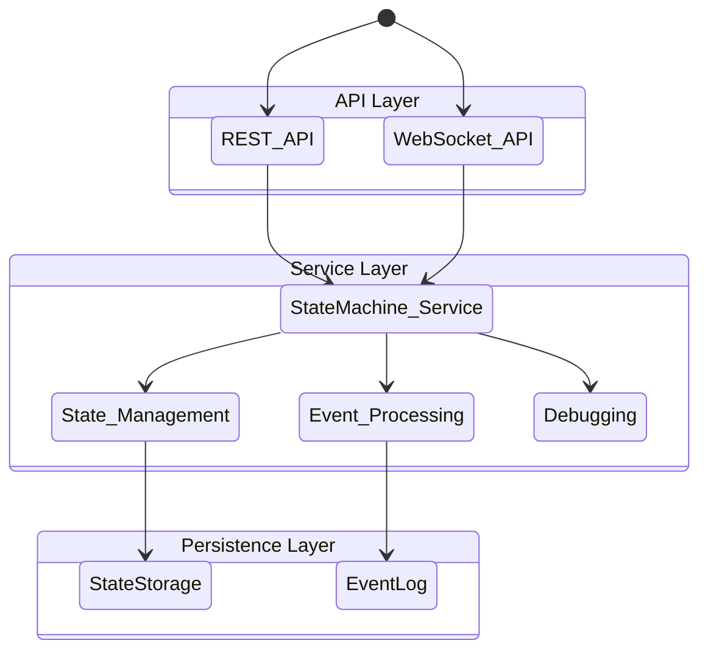
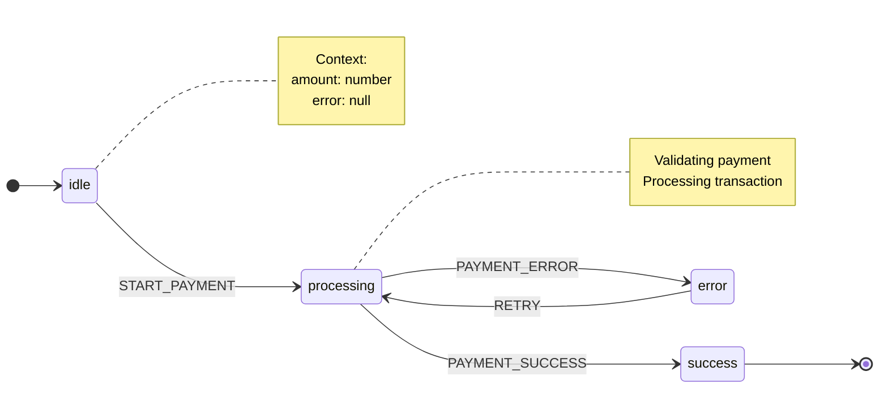
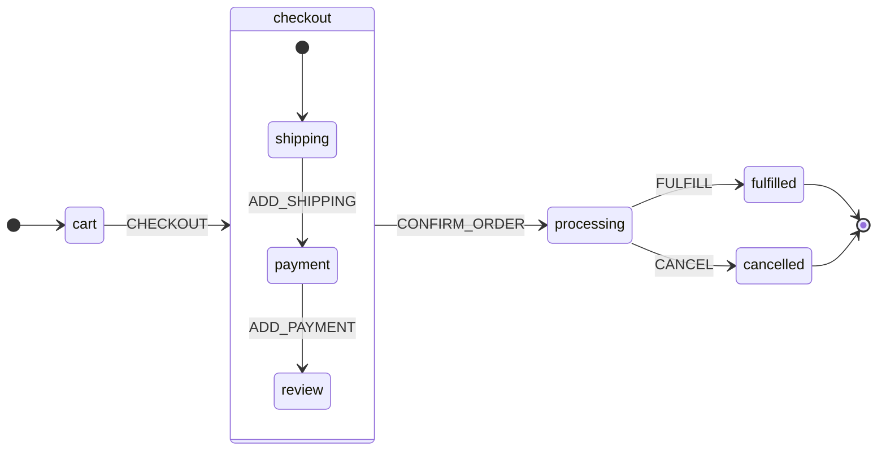

# State Machine Service Documentation

## Overview

The State Machine Service provides a type-safe interface to the state machine server with both REST and WebSocket interfaces. The service is designed for high reliability and real-time state management with support for persistence and debugging.

## Architecture



## REST API

### Base URL
```
https://your-server/api/v2
```

### Endpoints

#### Create Machine Instance
```http
POST /machines
Content-Type: application/json
X-API-Version: 2.0

{
  "machineId": "payment-123",
  "type": "payment",
  "context": {
    "amount": 0,
    "error": null
  }
}
```

#### Send Event
```http
POST /machines/{machineId}/events
Content-Type: application/json

{
  "type": "START_PAYMENT",
  "amount": 100
}
```

#### Get Machine State
```http
GET /machines/{machineId}
```

#### Get Available Machines
```http
GET /state-machines
```

## WebSocket API

### Connection
```typescript
const client = new WebSocketClient('wss://your-server/state-machine-ws');
await client.connect();
```

### Messages

#### Subscribe to Machine State
```typescript
client.subscribe('payment-123', (state) => {
  console.log('State updated:', state);
});
```

#### Send Event
```typescript
await client.sendEvent('payment-123', {
  type: 'START_PAYMENT',
  amount: 100
});
```

## Type Definitions

### State Machine Types
```typescript
interface BaseState<TContext, TEvent extends { type: string }> {
  type?: StateType;
  onEntry?: Array<(context: TContext, event: TEvent) => void>;
  onExit?: Array<(context: TContext, event: TEvent) => void>;
  transitions?: Array<Transition<TContext, TEvent>>;
  invoke?: Array<ServiceConfig<TContext, TEvent>>;
}

type StateType = 'atomic' | 'compound' | 'parallel' | 'history' | 'final';
```

### Event Types
```typescript
type PaymentEvent =
  | { type: 'START_PAYMENT'; amount: number }
  | { type: 'PAYMENT_SUCCESS' }
  | { type: 'PAYMENT_ERROR'; error: string }
  | { type: 'RETRY' };
```

### Context Types
```typescript
interface PaymentContext {
  amount: number;
  error: string | null;
}
```

## Available State Machines

### Payment Machine



#### States
- **idle**
  - Initial state
  - Transitions:
    - START_PAYMENT → processing
  - Required context: none

- **processing**
  - Transitions:
    - PAYMENT_SUCCESS → success
    - PAYMENT_ERROR → error
  - Context updates:
    - On entry: startedAt = timestamp
    - On error: error = event.error

- **success**
  - Final state
  - Context updates:
    - On entry: completedAt = timestamp

- **error**
  - Transitions:
    - RETRY → processing
  - Context requirements:
    - error: string

### Order Machine



## Client Usage

### REST Client
```typescript
const client = new StateMachineClient('https://your-server/api/v2');

// Create machine instance
const state = await client.createMachine('payment-123', {
  amount: 0,
  error: null
});

// Send event
await client.sendEvent('payment-123', {
  type: 'START_PAYMENT',
  amount: 100
});
```

### WebSocket Client
```typescript
const wsClient = new WebSocketClient('wss://your-server/state-machine-ws');
await wsClient.connect();

// Subscribe to state updates
const unsubscribe = wsClient.subscribe('payment-123', (state) => {
  console.log('State updated:', state);
});

// Send event
await wsClient.sendEvent('payment-123', {
  type: 'START_PAYMENT',
  amount: 100
});
```

### React Integration
```typescript
function PaymentComponent({ machineId }: { machineId: string }) {
  const { state, sendEvent } = useStateMachine(machineId);

  if (!state) return <div>Loading...</div>;

  return (
    <div>
      <h2>Payment State: {state.state}</h2>
      <div>Amount: ${state.context.amount}</div>
      
      {state.state === 'idle' && (
        <button
          onClick={() => 
            sendEvent({
              type: 'START_PAYMENT',
              amount: 100
            })
          }
        >
          Start Payment
        </button>
      )}
      
      {state.state === 'error' && (
        <div>
          <div>Error: {state.context.error}</div>
          <button
            onClick={() => sendEvent({ type: 'RETRY' })}
          >
            Retry
          </button>
        </div>
      )}
    </div>
  );
}
```

## Debugging

### State History
```typescript
const history = await client.getTransitionHistory('payment-123');
console.log('Transition history:', history);
```

### State Inspection
```typescript
const snapshots = await client.getSnapshots('payment-123');
console.log('State snapshots:', snapshots);
```

### Event Tracing
```typescript
wsClient.subscribe('payment-123', (state) => {
  console.log('Transition:', {
    from: state.fromState,
    to: state.state,
    event: state.lastEvent,
    duration: state.transitionDuration
  });
});
```

